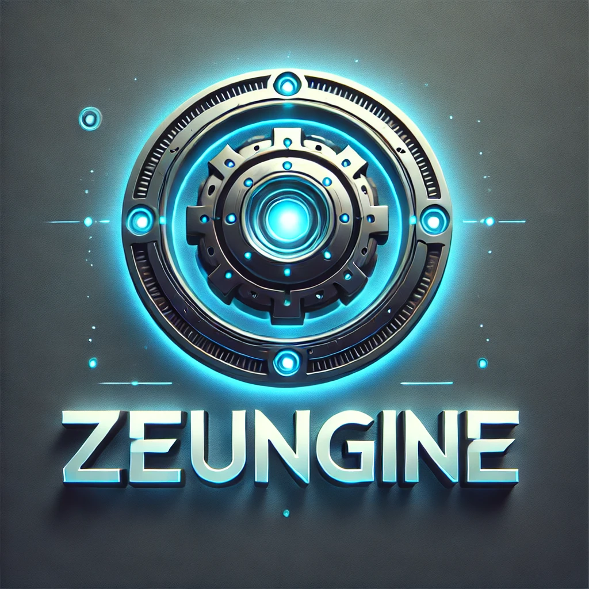

# Zeungine



A library that abstracts and simplifies 3D Game creation written in C++.

Supports [Windows 10/11](https://en.wikipedia.org/wiki/Microsoft_Windows), [Linux (X11/XCB/Wayland)](https://en.wikipedia.org/wiki/Linux) and [MacOS](https://en.wikipedia.org/wiki/MacOS) with support for [Android](https://en.wikipedia.org/wiki/Android_(operating_system)) and [iOS](https://en.wikipedia.org/wiki/IOS) in the roadmap

Uses CMake for it's build system and comes with some included tests


***zg*** uses many libraries to help piece together the engine

 - [OpenGL](https://www.opengl.org/)
 - [Vulkan](https://www.vulkan.org/)
 - [SPIRV-Tools](https://github.com/KhronosGroup/SPIRV-Tools)
 - [glslang](https://github.com/KhronosGroup/glslang)
 - [Boost Libraries](https://www.boost.org/)
 - [OpenSSL](https://www.openssl.org/)
 - [FFmpeg](https://www.ffmpeg.org/)
 - [zlib](https://github.com/madler/zlib)
 - [bzip2](https://github.com/libarchive/bzip2)
 - [lzma](https://tukaani.org/xz/)
 - [zstd](https://github.com/facebook/zstd)
 - [exprtk](https://github.com/ArashPartow/exprtk)
 - [brotli](https://github.com/google/brotli)
 - [freetype](https://freetype.org/)
 - [glm](https://github.com/icaven/glm)
 - [harfbuzz](https://harfbuzz.github.io/)
 - [png](http://www.libpng.org/pub/png/libpng.html)

### Features

 - Simple Entity/Scene/Window hierarchy with hot pluggable Component system 
 - Runtime Programmable Shader Pipeline
 - MSAA (HW Accelerated)
 - Lightweight Event Loop
 - Directional, Point & Spot Lights and Shadows
 - Runtime Programmable Post Processing Pipeline (P3)
 - Included P3 components such as Bloom

### Cloning

```bash
git clone git@github.com:Zeungine/Zeungine.git
```

### Releases

Releases are available on GitHub, see [here](https://github.com/Zeucor/Zeungine/releases). Zeungine comes as an all=in-one installer. Debug & Release binaries are packaged as well as headers for zg and many of the libraries listed above.

### Builing from Source

If you want a latest copy of Zeungine and dependencies then consider analyzing [`win-package.bat` or `unx-package.sh`] for their configure, compile, install and package commands

You'll also need to analyze one of the workflows in `.github/workflows` for specific platform dependencies required

### Testing

```bash
ctest --test-dir build --rerun-failed -VV -C Debug
```

### Usage

Once installed, you can include in cmake projects using the following cmake code:

```cmake
... (add_library(...))
find_package(Zeungine REQUIRED)
target_link_libraries(my-app PRIVATE ${Zeungine_LIBRARIES})
target_include_directories(my-app PRIVATE ${Zeungine_INCLUDE_DIR})
```

###### Some good example Tests

 - [Simple Window & Scene](/tests/SimpleWindowTest.cpp)
 - [Simple Cube](/tests/SimpleCubeTest.cpp)
 - [Video](/tests/VideoTest.cpp)
 - [Physics](/tests/PhysicsTest.cpp)

See [tests](/tests) for more usage examples

## License

Code is distributed under MIT license, feel free to use it in your proprietary projects as well.
